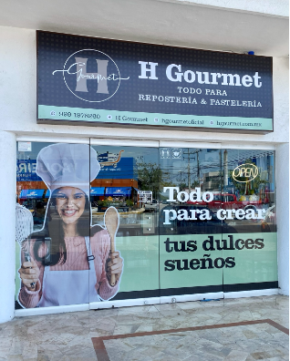
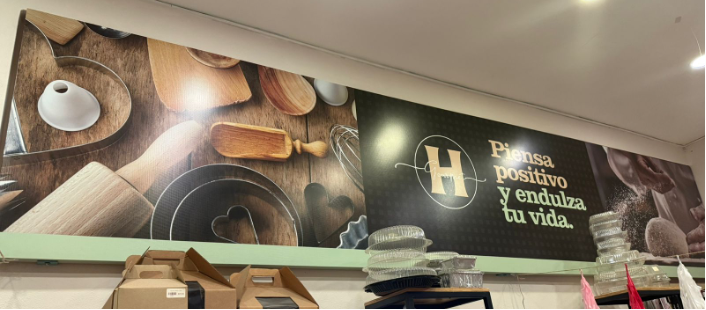
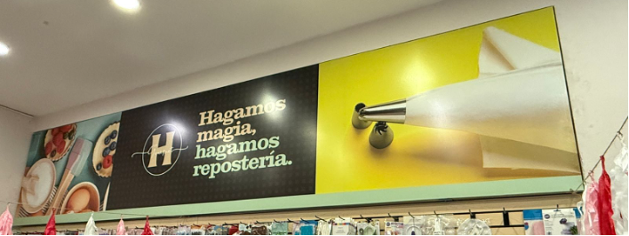

HGOURMET

•	PORTADA
En marca de agua imagen similar que en la fachada con utensilios y slogan “hagamos magia, hagamos repostería” .
 

En la margen superior izquierda, la barra de búsqueda 

En la parte superior central, el logotipo de Hgourmet:

 

En la margen superior derecha los iconos de: Carrito de compras y registro

Para el menú las pestañas serian:
1)	Inicio
2)	Productos (sección para administrar los productos, darlos de baja, alta, ocultarlos cuando no tengamos inventario)
•	Insumos
•	Utensilios
•	Decoración
•	Bases
•	Moldes
•	Desechables
•	Chocolates
3)	Recetas y Tips
•	Agregar recetas y tips, consejos de repostería, ocultar recetas por temporada
4)	Contacto
•	Agregar teléfonos, correo electrónico, redes sociales, horario de atención

Del lado izquierdo una columna con:
Lo más vendidos
Artículos de temporada

En la parte de en medio imágenes en transición en tonos cálidos como esta:

 

Como referencia los carteles que están en el interior de la tienda:
 

  

La siguiente seccion “Las marcas de Hgourmet”: donde se incluyan los logos de las marcas que manejamos en la tienda y puedan desplegarse akgunos articulos de cada marca.
En la parte inferior fijar el icono de wathsaap, siempre visible, para que puedan contactarnos en cualquier momento mediante wp

Podria agregarse una seccion de productos por categoria de la siguiente manera:
 

En la parte de debajo, agregar 
•	Iconos de redes sociales que enlacen directamente a las páginas
•	Iconos de métodos de pago (pago contra entrega física, con tarjetas, terminal punto de venta , transferencia
•	Política de envío
•	Forma de facturación (explicar como solicitar una factura)
Registrarse por medio de email para un boletín informativo

 
